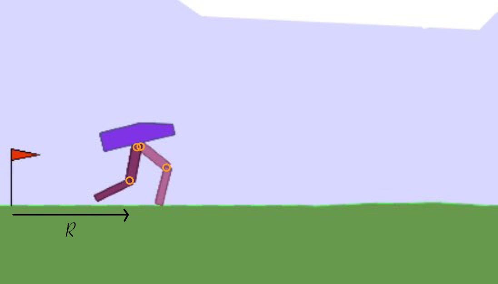

# Continuous Control in Reinforcement Learning

This repository contains an implementation and comparison of various Deep Reinforcement Learning algorithms for continuous control tasks, specifically using the **BipedalWalker-v3** environment from OpenAI Gym.

## Project Description

This project implements and evaluates three prominent algorithms for continuous control in Reinforcement Learning:

- **Deep Deterministic Policy Gradient (DDPG)**
- **Soft Actor-Critic (SAC)**
- **Proximal Policy Optimization (PPO)**

These algorithms are tested in the **BipedalWalker-v3** environment, a complex continuous control task where a bipedal robot must learn to walk efficiently without falling.

## Environment: BipedalWalker-v3



**Features:**

- **State space:** 24 dimensions (Position, joint angles, velocities, ground contact)
- **Action space:** 4 continuous dimensions \[-1, 1\] (Torques on hips & knees)
- **Reward system:**
  - positive reward for forward movement
  - negative reward for energy consumption and unnatural movements
  - +300 for reaching the goal
  - Penalty for falling

**Challenges:**

- Dynamic balance
- Sparse rewards
- Long-term planning
- High dimensionality

## 🔧 Installation

```bash
# Clone the repository
git clone https://github.com/LeonardKreil/continuous-control.git
cd continuous-control

# Create Python environment
conda create --name continuous-control python=3.8
conda activate continuous-control

# Install dependencies
pip install -r requirements.txt
pip install gym[box2d] 
 
```

## 📦 Contents of requirements.txt

The following core packages are included in the requirements.txt:
- gymnasium==0.28.1
- numpy==1.24.3
- torch==2.0.1
- matplotlib==3.7.1
- pandas==2.0.2
- stable-baselines3==2.1.0
- seaborn==0.12.2

## 📁 Project Structure
```bash
bipedal_control_experiment/
├── algorithms/
│   ├── ppo.py             # PPO implementation
│   ├── sac.py             # Soft Actor-Critic
│   ├── ddpg.py            # Deep Deterministic Policy Gradient
│   └── td3.py             # Twin Delayed DDPG (optional)
├── utils/
│   ├── logger.py          # Logging
│   ├── plotting.py        # Visualization
│   └── evaluation.py      # Evaluation
├── config/
│   ├── hyperparameters.py # Configuration
│   ├── callbacks.py
│   ├── evaluation.py
│   ├── logger.py
│   ├── multi_plot.py
│   ├── plot.py
│   └── plotting.py
├── experiments/
│   ├── experiment.py      # Experiment classes
│   └── compare.py         # Comparison functions
├── results/               # Results
├── models/                # Trained models
├── main.py                # Main script
└── requirements.txt       # Dependencies
```

## ▶️ Usage

To train or evaluate a reinforcement learning agent in a specific Gymnasium environment, use:

```bash
cd bipedal_control_experiment

python main.py --algo <algorithm> --env <environment> [--train_steps <timesteps>] [--eval_freq <frequency>] [--seed <seed>] [--visualize] [--compare]
```

### 🔧 Options

--algo – Algorithm to use (ppo, sac, ddpg)

--env – Gym environment (e.g., BipedalWalker-v3)

--train_steps – Number of training steps (default: 1000000)

--eval_freq – Evaluation frequency during training (default: 10000)

--seed – Random seed (default: 42)

--visualize – Visualize a trained agent instead of training

--compare – Compare all available algorithms on the selected environment

## 📈 Algorithm Comparison Usage
This script allows you to compare the performance (with mean and std of multiple runs) of different reinforcement learning algorithms by loading and plotting their training_log.csv files.

```bash
cd utils

python compare_results.py --patterns <pattern1> <pattern2> ... [options]
```

### 🔧 Options
--dir – Base directory where the result folders are located (default: current directory ".")

--patterns – Required. List of folder name patterns (e.g., ddpg_* ppo_*) to match experiment runs

--labels – Optional list of custom labels for each algorithm in the legend

--title – Plot title (default: "Comparison of different continuous controll algorithms")

--window – Moving average window size (default: 10)

--save – Path to save the plot (e.g., plots/comparison.png). If not set, the plot is shown instead

--colors – Optional list of colors for each algorithm plot (e.g., red blue green)

## 📊 Plot Multiple Reward Curves Usage
This script allows you to visualize and compare the reward progression from multiple training runs, each stored in a separate CSV file.

```bash
python plot_multiple_rewards.py --csv <file1.csv> <file2.csv> ... [options]
```

🔧 Options
--csv – Required. List of paths to CSV files containing timestep and reward columns

--labels – Optional list of custom labels for the legend (must match the number of CSVs)

--title – Plot title (default: "Reward-Vergleich")

--window – Moving average window size (default: 10)

--save – Path to save the plot as an image (e.g., plots/reward_plot.png). If not set, the plot is shown interactively

## Features:
- Selection of DDPG, SAC, PPO
- Configuration via config/
- Training and evaluation
- Visualization of results

## ⚖️ Algorithm Comparison

### 🧠 DDPG (Deep Deterministic Policy Gradient)
- Deterministic policy
- Actor-Critic architecture
- Ornstein-Uhlenbeck process for exploration
- Stabilized via replay buffer & target networks
- ❗️ Sensitive to hyperparameters

### 🔥 SAC (Soft Actor-Critic)
- Maximum-entropy framework
- Stochastic policy (mean & standard deviation)
- Two Q-networks to avoid overestimation
- Adaptive entropy regularization
- ✅ High stability & efficiency

### 📈 PPO (Proximal Policy Optimization)
- Clipping mechanism for stable updates
- On-policy learning
- Generalized Advantage Estimation
- ✅ Simple & efficient
- ❗️ Less efficient than off-policy methods

## 📊 Experimental Results

| Algorithm | Convergence Speed       | Max Reward | Training Time |
|-----------|--------------------------|------------|---------------|
| SAC       | High (~300k steps)       | ~300       | 5.50 hours    |
| PPO       | Medium (~400k steps)     | ~200       | 0.35 hours    |
| DDPG      | Low (>400k steps)        | ~0         | 1.25 hours    |

### Key Insights:

- SAC delivers the best performance and convergence
- PPO is efficient with low computational cost
- DDPG requires careful hyperparameter tuning

## 🔍 Theoretical Explanations

- SAC vs. DDPG: Entropy encourages exploration and prevents early convergence
- SAC vs. PPO: Off-policy learning enables data reuse
- DDPG vs. PPO: PPO provides more stable updates via clipping

## 🔭 Future Research Directions

- Model-based RL (e.g., dynamics learning)
- Hierarchical RL (task decomposition)
- Multi-task & transfer learning
- Incorporation of prior knowledge (e.g., physical models, demonstrations)
